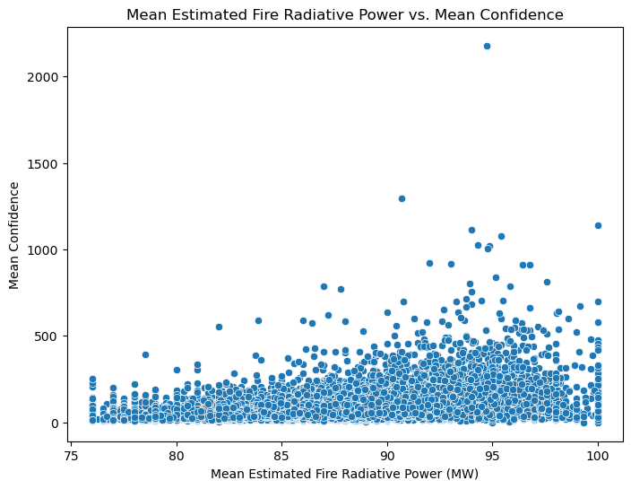

# Analyzing Wildfire Activities in Australia

## 💡 Introduction
This project investigates wildfire occurrences in Australia from 2005 to 2015. Using data from fire incident reports and meteorological records, the analysis identifies key trends, geographical patterns, and relationships between fire frequency and climate factors. The insights gained can support fire prevention and management efforts.

## 📊 Data Analysis & Visualizations
The analysis began with an exploration of the provided wildfire dataset. The following visualizations represent the main findings, with each plot accompanied by a brief explanation.

### Estimated Fire Area Over Time
The first two plots track the average estimated fire area over time. The first chart shows the yearly average, while the second provides a more granular view by month, revealing significant fluctuations.

### Distribution of Fire Brightness Across Regions
This bar chart shows the average estimated fire brightness (in Kelvin) across different regions. It highlights which regions experience the most intense fires, providing insight into fire severity by location.

### Percentage of Vegetation Fires by Region
The pie chart below illustrates the percentage of vegetation fires for each region. This visualization clearly shows which areas account for the highest proportion of wildfires.

### Histogram of Fire Brightness
This histogram displays the distribution of mean estimated fire brightness. The first plot shows the overall distribution, while the second plot uses hue to show the stacked distribution across different regions.

### Fire Radiative Power vs. Confidence
This scatter plot visualizes the relationship between the mean confidence level of a fire detection and its estimated radiative power. A positive correlation would suggest that more confident detections are also associated with more powerful fires.

### Geographic Distribution of Regions
Finally, a map is used to show the geographic locations of the analyzed regions in Australia. This provides a clear visual context for the regional data presented in the other charts.

[View Interactive Map](interactive_map.html)

## ✅ Conclusion
The analysis demonstrates significant trends and geographical patterns in Australian wildfires. Key findings include fluctuations in fire area over time and regional differences in fire brightness and occurrence. These insights are essential for understanding wildfire risk and for informing future fire management strategies.
